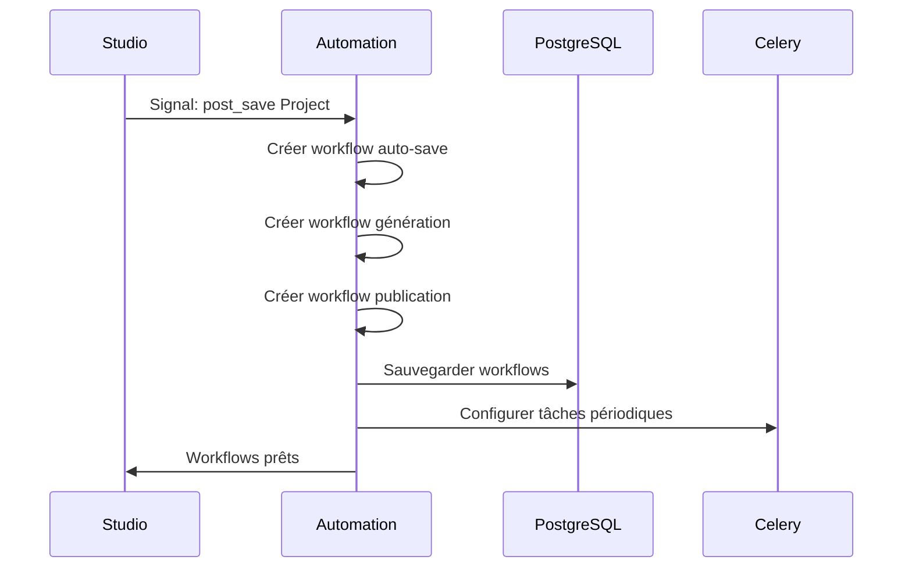
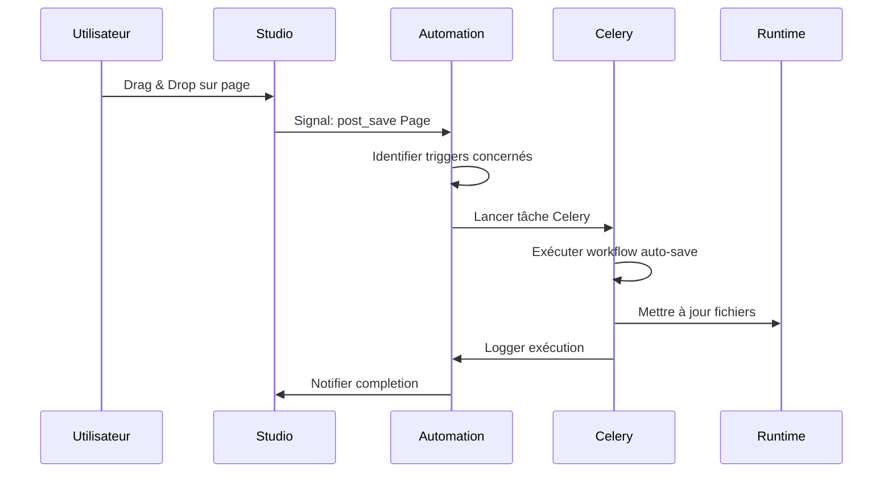
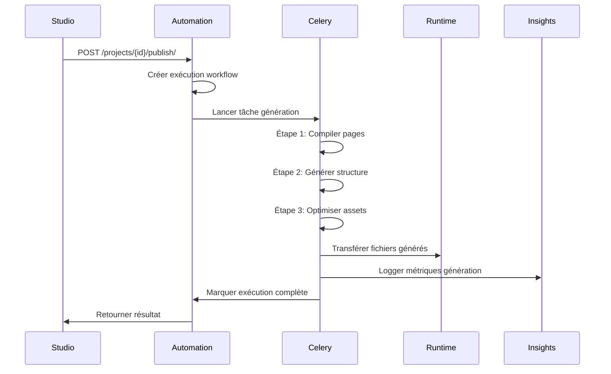

# ⚙️ Automation Module - Workflows & Triggers Automatiques

## 🎯 Rôle dans le Système NoCode

Automation est le **cerveau moteur** de la plateforme NoCode. C'est un **module système** qui fonctionne entièrement en arrière-plan pour exécuter des workflows, déclencher des actions et maintenir l'état cohérent de l'écosystème. **L'utilisateur n'interagit jamais directement avec ce module.**

### Responsabilités Principales
- **Création automatique** de workflows quand un projet est créé
- **Exécution des workflows** déclenchés par les actions utilisateur
- **Gestion des triggers** qui surveillent les changements
- **Orchestration des tâches** asynchrones via Celery
- **Logging et monitoring** des exécutions
- **Intégrations externes** (webhooks, APIs)

---

## 👥 Interface Utilisateur vs Système

### ❌ ENDPOINTS UTILISATEUR (Non accessibles directement)

**AUCUN** - L'utilisateur ne doit jamais accéder directement aux endpoints Automation.

### ✅ ENDPOINTS SYSTÈME (Gérés automatiquement)

#### Workflows (créés automatiquement)
```http
GET    /api/automation/workflows/                    # Liste workflows système
POST   /api/automation/workflows/                    # Créer workflow (système)
GET    /api/automation/workflows/{id}/               # Détails workflow
PUT    /api/automation/workflows/{id}/               # Modifier workflow
DELETE /api/automation/workflows/{id}/               # Supprimer workflow
POST   /api/automation/workflows/{id}/execute/       # Exécuter workflow
```

#### Triggers (configurés automatiquement)
```http
GET    /api/automation/triggers/                     # Liste triggers système
POST   /api/automation/triggers/                     # Créer trigger (système)
GET    /api/automation/triggers/{id}/                # Détails trigger
PUT    /api/automation/triggers/{id}/                # Modifier trigger
DELETE /api/automation/triggers/{id}/                # Supprimer trigger
POST   /api/automation/triggers/{id}/test/           # Tester trigger
```

#### Exécutions (résultats automatiques)
```http
GET    /api/automation/executions/                   # Historique exécutions
GET    /api/automation/executions/{id}/              # Détails exécution
POST   /api/automation/executions/{id}/retry/        # Réessayer exécution
POST   /api/automation/executions/{id}/cancel/       # Annuler exécution
```

#### Étapes de Workflow
```http
GET    /api/automation/workflows/{id}/steps/         # Étapes workflow
POST   /api/automation/workflows/{id}/steps/         # Ajouter étape
PUT    /api/automation/steps/{id}/                   # Modifier étape
DELETE /api/automation/steps/{id}/                   # Supprimer étape
POST   /api/automation/steps/{id}/execute/           # Exécuter étape
```

#### Intégrations
```http
GET    /api/automation/integrations/                 # Intégrations configurées
POST   /api/automation/integrations/                 # Ajouter intégration
GET    /api/automation/integrations/{id}/            # Détails intégration
POST   /api/automation/integrations/{id}/test/       # Tester intégration
```

---

## 🔄 Flux de Données dans Automation

### 1. Création Automatique de Workflows


### 2. Déclenchement par Action Utilisateur


### 3. Workflow de Génération d'Application


---

## 🏗️ Structure des Modèles

### Workflow (Enchaînement d'actions)
```python
class Workflow(models.Model):
    name = models.CharField(max_length=200)
    description = models.TextField(blank=True)
    project = models.ForeignKey('studio.Project', on_delete=models.CASCADE)
    trigger_type = models.CharField(choices=TRIGGER_TYPES)
    is_active = models.BooleanField(default=True)
    config = models.JSONField(default=dict)
    created_at = models.DateTimeField(auto_now_add=True)
    updated_at = models.DateTimeField(auto_now=True)
```

### Trigger (Condition de déclenchement)
```python
class Trigger(models.Model):
    workflow = models.ForeignKey(Workflow, on_delete=models.CASCADE)
    trigger_type = models.CharField(choices=TRIGGER_TYPES)
    event_type = models.CharField(max_length=100)
    conditions = models.JSONField(default=dict)
    is_active = models.BooleanField(default=True)
    last_triggered = models.DateTimeField(null=True, blank=True)
```

### WorkflowStep (Étape d'un workflow)
```python
class WorkflowStep(models.Model):
    workflow = models.ForeignKey(Workflow, on_delete=models.CASCADE)
    step_type = models.CharField(choices=STEP_TYPES)
    order = models.IntegerField()
    config = models.JSONField(default=dict)
    conditions = models.JSONField(default=dict)
    is_required = models.BooleanField(default=True)
```

### WorkflowExecution (Exécution d'un workflow)
```python
class WorkflowExecution(models.Model):
    workflow = models.ForeignKey(Workflow, on_delete=models.CASCADE)
    status = models.CharField(choices=STATUS_CHOICES)
    started_at = models.DateTimeField(auto_now_add=True)
    completed_at = models.DateTimeField(null=True, blank=True)
    trigger_data = models.JSONField(default=dict)
    result = models.JSONField(default=dict)
    error_message = models.TextField(blank=True)
```

### WorkflowExecutionLog (Logs détaillés)
```python
class WorkflowExecutionLog(models.Model):
    execution = models.ForeignKey(WorkflowExecution, on_delete=models.CASCADE)
    step = models.ForeignKey(WorkflowStep, on_delete=models.CASCADE, null=True)
    level = models.CharField(choices=LOG_LEVELS)
    message = models.TextField()
    details = models.JSONField(default=dict)
    step_identifier = models.CharField(max_length=100)  # Ajouté récemment
```

---

## 🎯 Types de Workflows Automatiques

### 1. Workflow Auto-Save
```json
{
  "name": "Auto-save Project",
  "trigger_type": "ON_PAGE_CHANGE",
  "steps": [
    {
      "step_type": "VALIDATE_PAGE",
      "config": {"validate_json": true, "check_components": true}
    },
    {
      "step_type": "SAVE_TO_RUNTIME",
      "config": {"update_files": true, "backup_previous": true}
    },
    {
      "step_type": "LOG_ACTIVITY",
      "config": {"track_changes": true, "save_metrics": true}
    }
  ]
}
```

### 2. Workflow de Génération
```json
{
  "name": "Generate Application",
  "trigger_type": "ON_PUBLISH",
  "steps": [
    {
      "step_type": "COMPILE_PAGES",
      "config": {"minify": true, "optimize_images": true}
    },
    {
      "step_type": "GENERATE_STRUCTURE",
      "config": {"create_routes": true, "generate_models": false}
    },
    {
      "step_type": "DEPLOY_TO_RUNTIME",
      "config": {"environment": "production", "rollback_enabled": true}
    },
    {
      "step_type": "NOTIFY_USER",
      "config": {"send_email": true, "update_status": true}
    }
  ]
}
```

### 3. Workflow de Nettoyage
```json
{
  "name": "Cleanup Old Data",
  "trigger_type": "SCHEDULED",
  "schedule": "0 2 * * *",  # Tous les jours à 2h du matin
  "steps": [
    {
      "step_type": "CLEAN_OLD_EXECUTIONS",
      "config": {"older_than_days": 30}
    },
    {
      "step_type": "CLEAN_TEMP_FILES",
      "config": {"older_than_hours": 24}
    },
    {
      "step_type": "OPTIMIZE_DATABASE",
      "config": {"vacuum": true, "analyze": true}
    }
  ]
}
```

---

## ⚡ Types de Triggers

### Triggers Basés sur les Événements
- **ON_PROJECT_CREATE** : Quand un projet est créé
- **ON_PROJECT_UPDATE** : Quand un projet est modifié
- **ON_PAGE_CREATE** : Quand une page est créée
- **ON_PAGE_UPDATE** : Quand une page est modifiée (drag & drop)
- **ON_COMPONENT_ADD** : Quand un composant est ajouté
- **ON_PUBLISH** : Quand un projet est publié

### Triggers Temporels
- **SCHEDULED** : Exécution périodique (cron)
- **DELAYED** : Exécution après délai
- **TIMEOUT** : Exécution après inactivité

### Triggers Externes
- **WEBHOOK** : Déclenchement par webhook externe
- **API_CALL** : Déclenchement par appel API
- **FILE_CHANGE** : Déclenchement par modification de fichier

---

## 🔧 Intégration avec Celery

### Configuration des Tâches
```python
# apps/automation/tasks.py
from celery import shared_task
from .models import Workflow, WorkflowExecution

@shared_task(bind=True, max_retries=3)
def execute_workflow(self, workflow_id, trigger_data):
    try:
        workflow = Workflow.objects.get(id=workflow_id)
        execution = WorkflowExecution.objects.create(
            workflow=workflow,
            trigger_data=trigger_data,
            status='RUNNING'
        )
        
        # Exécuter chaque étape
        for step in workflow.steps.all():
            result = execute_step(step, execution)
            if not result['success']:
                execution.status = 'FAILED'
                execution.error_message = result['error']
                execution.save()
                return
        
        execution.status = 'COMPLETED'
        execution.completed_at = timezone.now()
        execution.save()
        
    except Exception as exc:
        self.retry(exc=exc, countdown=60)

@shared_task
def auto_save_project(project_id, page_data):
    """Tâche d'auto-sauvegarde déclenchée par drag & drop"""
    workflow = Workflow.objects.get(
        project_id=project_id,
        trigger_type='ON_PAGE_CHANGE'
    )
    execute_workflow.delay(workflow.id, {'page_data': page_data})
```

### Monitoring avec Flower
```bash
# Démarrer Flower pour monitoring
celery -A NoCode_Backend flower --port=5555

# Accès : http://localhost:5555
# - Voir les tâches en cours
# - Monitorer les performances
# - Redémarrer les tâches échouées
```

---

## 🔄 Communication Inter-Modules

### Signaux Écoutés par Automation
```python
# Écouter les créations de projets
@receiver(post_save, sender=studio.models.Project)
def create_project_workflows(sender, instance, created, **kwargs):
    if created:
        # Créer workflows par défaut
        Workflow.objects.create(
            name=f"Auto-save {instance.name}",
            project=instance,
            trigger_type='ON_PAGE_CHANGE'
        )

# Écouter les modifications de pages
@receiver(post_save, sender=studio.models.Page)
def trigger_auto_save(sender, instance, **kwargs):
    # Déclencher workflow d'auto-sauvegarde
    workflow = Workflow.objects.get(
        project=instance.project,
        trigger_type='ON_PAGE_CHANGE'
    )
    execute_workflow.delay(workflow.id, {
        'page_id': instance.id,
        'config': instance.config
    })
```

### Actions Déclenchées vers d'autres Modules
```python
def execute_step(step, execution):
    if step.step_type == 'SAVE_TO_RUNTIME':
        # Appeler Runtime pour sauvegarder les fichiers
        from apps.runtime.services import save_project_files
        return save_project_files(execution.workflow.project, step.config)
    
    elif step.step_type == 'LOG_ACTIVITY':
        # Appeler Insights pour enregistrer l'activité
        from apps.insights.services import log_workflow_activity
        return log_workflow_activity(execution, step.config)
    
    elif step.step_type == 'SEND_NOTIFICATION':
        # Envoyer notifications via Foundation
        from apps.foundation.services import send_notification
        return send_notification(execution.workflow.project.owner, step.config)
```

---

## 📊 Monitoring et Logging

### Métriques Collectées
- **Temps d'exécution** des workflows
- **Taux de succès** par type de workflow
- **Erreurs fréquentes** et leurs causes
- **Performance** des étapes individuelles
- **Utilisation des ressources** CPU/mémoire

### Logs Structurés
```python
# Exemple de log d'exécution
{
  "timestamp": "2024-01-15T10:30:00Z",
  "execution_id": "exec-123",
  "workflow_id": "workflow-456",
  "project_id": "project-789",
  "step": "SAVE_TO_RUNTIME",
  "level": "INFO",
  "message": "Files saved successfully",
  "duration_ms": 1250,
  "metadata": {
    "files_count": 15,
    "total_size_kb": 2048,
    "compression_ratio": 0.65
  }
}
```

### Alertes et Notifications
- **Échecs répétés** d'un workflow
- **Performance dégradée** (> 10s)
- **Ressources saturées** (CPU > 80%)
- **Erreurs critiques** (base de données, fichiers)

---

## 🚨 Gestion des Erreurs

### Stratégies de Retry
```python
# Configuration par type d'erreur
RETRY_CONFIG = {
    'DATABASE_ERROR': {'max_retries': 3, 'backoff': 60},
    'NETWORK_ERROR': {'max_retries': 5, 'backoff': 30},
    'FILE_SYSTEM_ERROR': {'max_retries': 2, 'backoff': 120},
    'VALIDATION_ERROR': {'max_retries': 0},  # Pas de retry
}
```

### Fallbacks et Recovery
- **Sauvegarde automatique** avant modification
- **Rollback** en cas d'échec
- **Mode dégradé** si services indisponibles
- **Notification admin** pour erreurs critiques

---

## 🔧 Configuration et Dépannage

### Variables d'Environnement
```bash
# Celery Settings
CELERY_BROKER_URL=redis://localhost:6379/0
CELERY_RESULT_BACKEND=redis://localhost:6379/0
CELERY_WORKER_CONCURRENCY=4
CELERY_TASK_SOFT_TIME_LIMIT=300  # 5 minutes
CELERY_TASK_TIME_LIMIT=600      # 10 minutes

# Workflow Settings
MAX_CONCURRENT_WORKFLOWS=10
WORKFLOW_TIMEOUT=1800  # 30 minutes
AUTO_SAVE_INTERVAL=30  # secondes
```

### Problèmes Courants
- **Workflow bloqué** : Vérifier les logs Celery
- **Trigger non déclenché** : Valider la configuration du signal
- **Performance lente** : Optimiser les étapes de workflow
- **Retry en boucle** : Configurer correctement les backoffs

### Commands Utiles
```bash
# Voir les tâches en cours
celery -A NoCode_Backend inspect active

# Vider la queue des tâches
celery -A NoCode_Backend purge

# Redémarrer un worker
celery -A NoCode_Backend control pool_restart

# Monitorer avec Flower
celery -A NoCode_Backend flower
```

---

## 📈 Performance et Scalabilité

### Optimisations
- **Parallélisation** des étapes indépendantes
- **Cache Redis** pour les configurations fréquentes
- **Batch processing** pour les grosses opérations
- **Lazy evaluation** des conditions complexes

### Scaling Horizontal
- **Multiple workers** Celery
- **Queue routing** par type de workflow
- **Load balancing** des exécutions
- **Database sharding** par projet

---

## 🔗 Références Techniques

### Structure d'Exécution
```python
# Exemple d'exécution complexe
execution = {
  "workflow_id": "workflow-generate-123",
  "trigger": {
    "type": "ON_PUBLISH",
    "data": {
      "project_id": "project-456",
      "user_id": "user-789",
      "timestamp": "2024-01-15T10:30:00Z"
    }
  },
  "steps": [
    {
      "order": 1,
      "type": "VALIDATE_PAGES",
      "status": "COMPLETED",
      "duration_ms": 500,
      "result": {"valid_pages": 5, "errors": []}
    },
    {
      "order": 2,
      "type": "GENERATE_FILES",
      "status": "RUNNING",
      "duration_ms": 2000,
      "progress": 0.6
    }
  ],
  "status": "RUNNING",
  "started_at": "2024-01-15T10:30:00Z",
  "estimated_completion": "2024-01-15T10:32:00Z"
}
```

---

**Automation** est le moteur invisible qui rend la magie NoCode possible. Chaque action utilisateur est automatiquement transformée en workflows exécutés en arrière-plan, assurant cohérence, performance et scalabilité de la plateforme.
