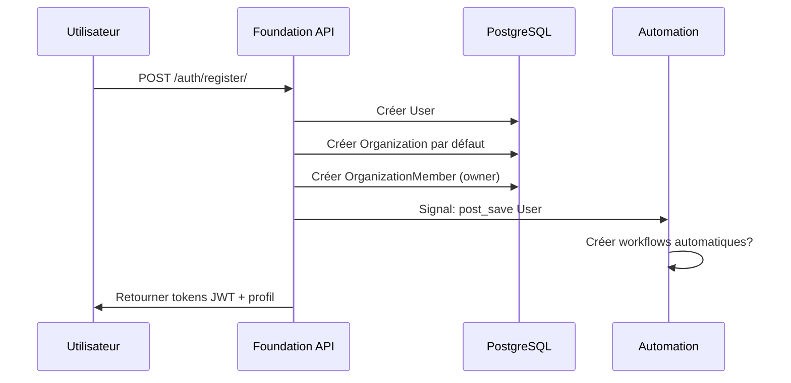
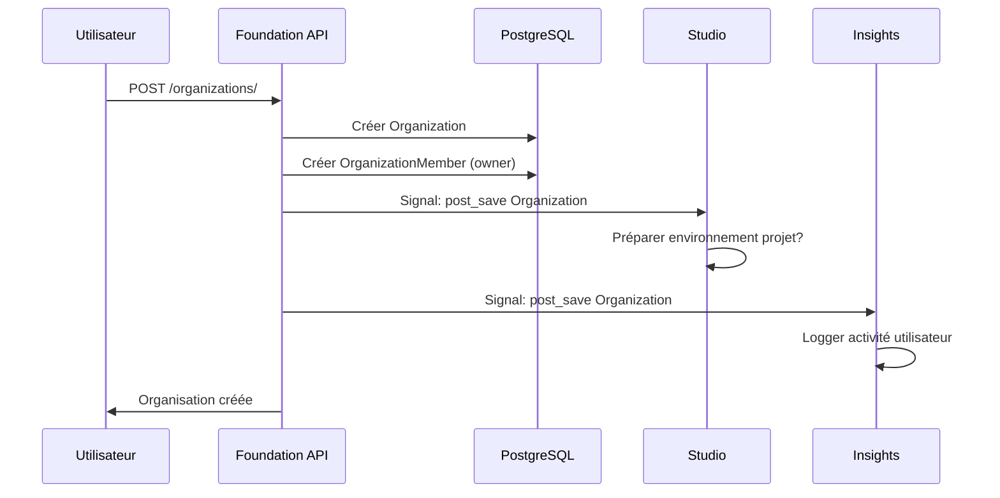

# 🏛️ Foundation Module - Authentification & Gestion des Organisations

## 🎯 Rôle dans le Système NoCode

Foundation est le module **fondamental** qui gère toute l'identité et l'organisation dans la plateforme NoCode. C'est un **module utilisateur** - toutes ses fonctionnalités sont directement accessibles par les utilisateurs.

### Responsabilités Principales
- **Authentification** des utilisateurs (inscription, connexion, déconnexion)
- **Gestion des organisations** (création, modification, membres)
- **Contrôle d'accès** et permissions par rôle
- **Profils utilisateur** et abonnements

---

## 👥 Interface Utilisateur vs Système

### ✅ ENDPOINTS UTILISATEUR (Accessibles directement)

#### Authentification
```http
POST /api/foundation/auth/register/     # Inscription nouvel utilisateur
POST /api/foundation/auth/login/        # Connexion utilisateur
POST /api/foundation/auth/logout/       # Déconnexion
POST /api/foundation/auth/refresh/      # Rafraîchir token JWT
GET  /api/foundation/auth/profile/      # Profil utilisateur connecté
PUT  /api/foundation/auth/profile/      # Mettre à jour profil
```

#### Organisations
```http
GET    /api/foundation/organizations/           # Liste organisations utilisateur
POST   /api/foundation/organizations/           # Créer organisation
GET    /api/foundation/organizations/{id}/      # Détails organisation
PUT    /api/foundation/organizations/{id}/      # Modifier organisation
DELETE /api/foundation/organizations/{id}/      # Supprimer organisation
```

#### Membres d'Organisation
```http
GET    /api/foundation/organizations/{id}/members/        # Liste membres
POST   /api/foundation/organizations/{id}/members/        # Ajouter membre
PUT    /api/foundation/organization-members/{id}/         # Modifier rôle membre
DELETE /api/foundation/organization-members/{id}/         # Supprimer membre
```

#### Abonnements
```http
GET  /api/foundation/subscriptions/          # Abonnements utilisateur
POST /api/foundation/subscriptions/          # Créer abonnement
GET  /api/foundation/subscription-types/     # Types d'abonnements disponibles
```

### ❌ ENDPOINTS SYSTÈME (Non accessibles directement)

Foundation n'a **aucun endpoint système** - tout est géré par l'utilisateur directement.

---

## 🔄 Flux de Données dans Foundation

### 1. Processus d'Inscription


### 2. Création d'Organisation


---

## 🏗️ Structure des Modèles

### User (Utilisateur)
```python
class User(AbstractBaseUser):
    email = models.EmailField(unique=True)
    nom = models.CharField(max_length=100)
    prenom = models.CharField(max_length=100)
    pays = models.CharField(max_length=100)
    numero_telephone = models.CharField(max_length=20)
    is_active = models.BooleanField(default=True)
    is_staff = models.BooleanField(default=False)
    date_joined = models.DateTimeField(auto_now_add=True)
```

### Organization (Organisation)
```python
class Organization(models.Model):
    name = models.CharField(max_length=200)
    description = models.TextField(blank=True)
    owner = models.ForeignKey(User, on_delete=models.CASCADE)
    is_active = models.BooleanField(default=True)
    is_verified = models.BooleanField(default=False)
    created_at = models.DateTimeField(auto_now_add=True)
```

### OrganizationMember (Membre)
```python
class OrganizationMember(models.Model):
    user = models.ForeignKey(User, on_delete=models.CASCADE)
    organization = models.ForeignKey(Organization, on_delete=models.CASCADE)
    role = models.CharField(choices=ROLE_CHOICES)  # OWNER, ADMIN, MEMBER
    status = models.CharField(choices=STATUS_CHOICES)  # ACTIVE, INACTIVE
    joined_at = models.DateTimeField(auto_now_add=True)
```

---

## 🔐 Sécurité et Permissions

### Rôles et Permissions
- **OWNER** : Administration complète de l'organisation
- **ADMIN** : Gestion des membres et projets
- **MEMBER** : Accès aux projets uniquement

### Isolation des Données
- Chaque utilisateur ne voit que ses organisations
- Chaque organisation est isolée des autres
- Permissions vérifiées à chaque requête API

### JWT Authentication
- Tokens d'accès : 15 minutes
- Tokens de rafraîchissement : 7 jours
- Blacklist des tokens révoqués

---

## 📊 Interactions avec les Autres Modules

### Signaux Émis par Foundation
```python
# Signal émis quand un utilisateur s'inscrit
@receiver(post_save, sender=User)
def user_created(sender, instance, created, **kwargs):
    if created:
        # Automation peut créer des workflows par défaut
        # Insights peut commencer le tracking
        pass

# Signal émis quand une organisation est créée
@receiver(post_save, sender=Organization)
def organization_created(sender, instance, created, **kwargs):
    if created:
        # Studio prépare un environnement
        # Automation configure des triggers
        pass
```

### Données Partagées
- **User** → Référencé dans tous les autres modules
- **Organization** → Isolation multi-tenant dans Studio, Automation, Runtime
- **Permissions** → Héritées dans tous les modules

---

## 🎨 Interface Django Admin

### Models Disponibles
- **Users** : Gestion des comptes utilisateurs
- **Organizations** : Administration des organisations
- **Organization Members** : Gestion des membres
- **Subscription Types** : Types d'abonnements
- **Subscriptions** : Abonnements actifs

### Actions en Masse
- Activer/Désactiver des organisations
- Vérifier des organisations
- Gérer les abonnements

---

## 🚨 Cas d'Usage et Bonnes Pratiques

### Cas d'Usage Typiques
1. **Inscription** : Un utilisateur s'inscrit et crée son organisation
2. **Collaboration** : Invitation de membres dans une organisation
3. **Gestion** : Administration des rôles et permissions
4. **Abonnement** : Gestion des plans tarifaires

### Bonnes Pratiques
- **Validation email** obligatoire avant activation
- **Limitation rate** sur les endpoints d'authentification
- **Audit log** de toutes les actions sensibles
- **Isolation stricte** des données par organisation

---

## 🔧 Configuration et Dépannage

### Variables d'Environnement
```bash
# JWT Settings
JWT_SECRET_KEY=votre-secret-key
JWT_ACCESS_TOKEN_LIFETIME=15
JWT_REFRESH_TOKEN_LIFETIME=604800

# Email Settings
EMAIL_HOST=smtp.gmail.com
EMAIL_PORT=587
EMAIL_HOST_USER=votre-email@gmail.com
EMAIL_HOST_PASSWORD=votre-password
```

### Problèmes Courants
- **Token expiré** : Utiliser l'endpoint refresh
- **Permission refusée** : Vérifier les rôles organisation
- **Email non validé** : Confirmer l'email utilisateur

---

## 📈 Évolution et Scalabilité

### Fonctionnalités Futures
- **OAuth2** : Connexion via Google, GitHub, etc.
- **2FA** : Authentification à deux facteurs
- **SSO** : Single Sign-On pour entreprises
- **Audit avancé** : Logs détaillés de conformité

### Scaling Considerations
- **Cache Redis** : Sessions utilisateur et permissions
- **Database sharding** : Par organisation si nécessaire
- **Load balancing** : Multiple instances Foundation
- **CDN** : Pour les assets statiques d'authentification

---

## 🔗 Références API

### Exemple de Requête
```bash
# Inscription
curl -X POST http://localhost:8000/api/foundation/auth/register/ \
  -H "Content-Type: application/json" \
  -d '{
    "email": "user@example.com",
    "password": "SecurePassword123!",
    "nom": "Dupont",
    "prenom": "Jean",
    "pays": "France",
    "numero_telephone": "+33612345678"
  }'

# Créer Organisation
curl -X POST http://localhost:8000/api/foundation/organizations/ \
  -H "Authorization: Bearer <access_token>" \
  -H "Content-Type: application/json" \
  -d '{
    "name": "Ma Entreprise",
    "description": "Entreprise de développement web"
  }'
```

### Codes de Réponse
- `200` : Succès
- `201` : Ressource créée
- `400` : Erreur de validation
- `401` : Non authentifié
- `403` : Permission refusée
- `404` : Ressource non trouvée

---

**Foundation** est le socle sur lequel toute la plateforme NoCode repose. Il garantit la sécurité, l'identité et l'organisation nécessaires pour une expérience utilisateur fluide et professionnelle.
