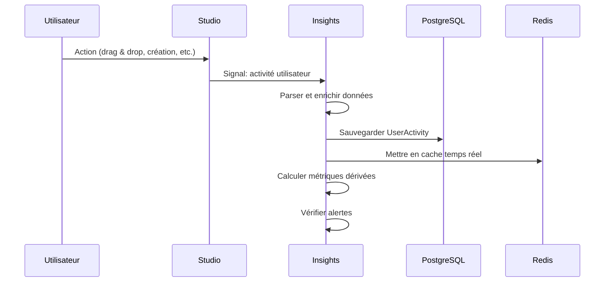
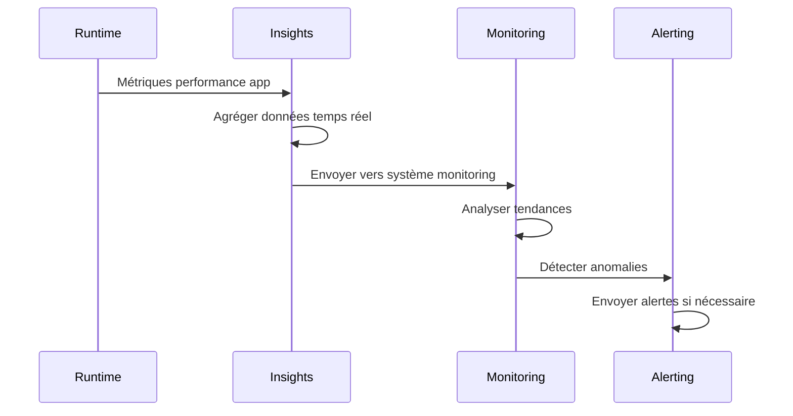
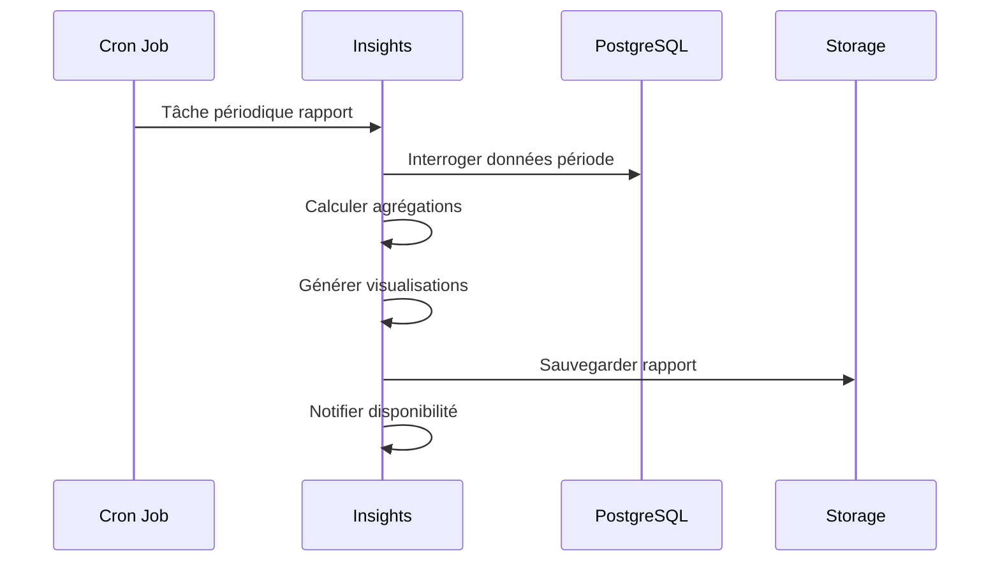

# 📊 Insights Module - Analytics & Monitoring Automatique

## 🎯 Rôle dans le Système NoCode

Insights est le **module d'intelligence** qui collecte, analyse et présente toutes les données d'utilisation et performance de la plateforme NoCode. C'est un **module système** qui fonctionne entièrement en arrière-plan pour fournir des analytics en temps réel. **L'utilisateur n'interagit jamais directement avec ce module.**

### Responsabilités Principales
- **Collecte automatique** des activités utilisateur
- **Monitoring des performances** applications et système
- **Analytics temps réel** des comportements utilisateurs
- **Génération de rapports** et dashboards
- **Alerting** sur les anomalies et problèmes
- **Tracking des métriques métier**

---

## 👥 Interface Utilisateur vs Système

### ❌ ENDPOINTS UTILISATEUR (Non accessibles directement)

**AUCUN** - L'utilisateur ne doit jamais accéder directement aux endpoints Insights.

### ✅ ENDPOINTS SYSTÈME (Gérés automatiquement)

#### Activités Utilisateur
```http
GET    /api/insights/user-activities/           # Historique activités
POST   /api/insights/user-activities/           # Logger activité (système)
GET    /api/insights/user-activities/{id}/      # Détails activité
GET    /api/insights/user-activities/stats/     # Statistiques agrégées
```

#### Métriques Système
```http
GET    /api/insights/system-metrics/            # Métriques système
POST   /api/insights/system-metrics/            # Enregistrer métrique
GET    /api/insights/system-metrics/{id}/       # Détails métrique
GET    /api/insights/system-metrics/current/    # Métriques temps réel
```

#### Métriques Applications
```http
GET    /api/insights/application-metrics/       # Métriques apps
POST   /api/insights/application-metrics/       # Enregistrer métrique app
GET    /api/insights/application-metrics/{id}/  # Détails métrique app
GET    /api/insights/application-metrics/stats/ # Stats applications
```

#### Métriques Utilisateurs
```http
GET    /api/insights/user-metrics/              # Métriques utilisateurs
POST   /api/insights/user-metrics/              # Enregistrer métrique user
GET    /api/insights/user-metrics/{id}/         # Détails métrique user
```

#### Métriques Performance
```http
GET    /api/insights/performance-metrics/       # Métriques performance
POST   /api/insights/performance-metrics/       # Enregistrer perf métrique
GET    /api/insights/performance-metrics/{id}/  # Détails perf métrique
GET    /api/insights/performance-metrics/trends/ # Tendances performance
```

#### Rapports et Dashboards
```http
GET    /api/insights/reports/                   # Rapports disponibles
POST   /api/insights/reports/                   # Générer rapport
GET    /api/insights/reports/{id}/              # Contenu rapport
GET    /api/insights/dashboards/                # Dashboards configurés
GET    /api/insights/dashboards/{id}/data/      # Données dashboard
```

---

## 🔄 Flux de Données dans Insights

### 1. Collecte Automatique des Activités


### 2. Monitoring des Performances


### 3. Génération de Rapports


---

## 🏗️ Structure des Modèles

### UserActivity (Activité Utilisateur)
```python
class UserActivity(BaseModel):
    user = models.ForeignKey('foundation.User', on_delete=models.CASCADE)
    activity_type = models.CharField(max_length=100)
    description = models.TextField(blank=True)
    ip_address = models.GenericIPAddressField()
    user_agent = models.TextField(blank=True)
    referrer = models.URLField(blank=True)
    metadata = models.JSONField(default=dict)
```

### SystemMetric (Métriques Système)
```python
class SystemMetric(BaseModel):
    metric_name = models.CharField(max_length=100)
    metric_type = models.CharField(max_length=50)
    value = models.FloatField()
    unit = models.CharField(max_length=20, blank=True)
    tags = models.JSONField(default=dict)
    dimensions = models.JSONField(default=dict)
```

### ApplicationMetric (Métriques Applications)
```python
class ApplicationMetric(BaseModel):
    app_name = models.CharField(max_length=200)
    metric_name = models.CharField(max_length=100)
    metric_type = models.CharField(max_length=50)
    value = models.FloatField()
    unit = models.CharField(max_length=20, blank=True)
    tags = models.JSONField(default=dict)
    metadata = models.JSONField(default=dict)
```

### UserMetric (Métriques Utilisateurs)
```python
class UserMetric(BaseModel):
    user = models.ForeignKey('foundation.User', on_delete=models.CASCADE)
    metric_name = models.CharField(max_length=100)
    metric_type = models.CharField(max_length=50)
    value = models.FloatField()
    unit = models.CharField(max_length=20, blank=True)
    session_id = models.CharField(max_length=100, blank=True)
    tags = models.JSONField(default=dict)
```

### PerformanceMetric (Métriques Performance)
```python
class PerformanceMetric(BaseModel):
    metric_name = models.CharField(max_length=100)
    metric_type = models.CharField(max_length=50)
    value = models.FloatField()
    unit = models.CharField(max_length=20, blank=True)
    response_time_ms = models.FloatField(null=True, blank=True)
    status_code = models.IntegerField(null=True, blank=True)
    tags = models.JSONField(default=dict)
    dimensions = models.JSONField(default=dict)
```

---

## 📊 Types de Données Collectées

### 1. Activités Utilisateur
```json
{
  "user_id": "user-123",
  "activity_type": "PAGE_CREATE",
  "description": "Création de page 'Contact'",
  "metadata": {
    "project_id": "project-456",
    "page_name": "Contact",
    "components_added": 3,
    "time_spent_seconds": 120
  },
  "context": {
    "ip_address": "192.168.1.100",
    "user_agent": "Mozilla/5.0...",
    "referrer": "/studio/projects/456",
    "timestamp": "2024-01-15T10:30:00Z"
  }
}
```

### 2. Métriques Système
```json
{
  "metric_name": "cpu_usage",
  "metric_type": "GAUGE",
  "value": 45.2,
  "unit": "percent",
  "tags": {
    "host": "server-01",
    "environment": "production"
  },
  "dimensions": {
    "cores": 8,
    "frequency_mhz": 2400
  }
}
```

### 3. Métriques Applications
```json
{
  "app_name": "portfolio-website",
  "metric_name": "page_views",
  "metric_type": "COUNTER",
  "value": 1250,
  "unit": "count",
  "tags": {
    "environment": "production",
    "version": "1.2.0"
  },
  "metadata": {
    "unique_visitors": 890,
    "bounce_rate": 0.25,
    "avg_session_duration": 180
  }
}
```

### 4. Métriques Performance
```json
{
  "metric_name": "response_time",
  "metric_type": "HISTOGRAM",
  "value": 245.5,
  "unit": "milliseconds",
  "response_time_ms": 245.5,
  "status_code": 200,
  "tags": {
    "endpoint": "/api/studio/projects/",
    "method": "GET"
  },
  "dimensions": {
    "p50": 180,
    "p95": 450,
    "p99": 1200
  }
}
```

---

## 🔄 Intégration avec les Autres Modules

### Middleware de Collecte d'Activités
```python
# apps/insights/middleware.py
class ActivityTrackingMiddleware:
    def __init__(self, get_response):
        self.get_response = get_response
    
    def __call__(self, request):
        # Collecter les données avant traitement
        start_time = time.time()
        
        response = self.get_response(request)
        
        # Logger l'activité si utilisateur authentifié
        if request.user.is_authenticated:
            self.log_user_activity(request, response, start_time)
        
        return response
    
    def log_user_activity(self, request, response, start_time):
        """Logger l'activité utilisateur"""
        activity_type = self.get_activity_type(request)
        
        UserActivity.objects.create(
            user=request.user,
            activity_type=activity_type,
            description=self.get_description(request),
            ip_address=self.get_client_ip(request),
            user_agent=request.META.get('HTTP_USER_AGENT', ''),
            referrer=request.META.get('HTTP_REFERER', ''),
            metadata={
                'path': request.path,
                'method': request.method,
                'status_code': response.status_code,
                'response_time_ms': (time.time() - start_time) * 1000
            }
        )
```

### Signaux Écoutés
```python
# apps/insights/signals.py
@receiver(post_save, sender=studio.models.Project)
def track_project_activity(sender, instance, created, **kwargs):
    """Tracker les activités de projet"""
    if created:
        UserActivity.objects.create(
            user=instance.owner,
            activity_type='PROJECT_CREATE',
            description=f"Création du projet '{instance.name}'",
            metadata={
                'project_id': instance.id,
                'project_name': instance.name
            }
        )

@receiver(post_save, sender=studio.models.Page)
def track_page_activity(sender, instance, **kwargs):
    """Tracker les modifications de pages"""
    UserActivity.objects.create(
        user=get_current_user(),
        activity_type='PAGE_UPDATE',
        description=f"Modification de la page '{instance.name}'",
        metadata={
            'page_id': instance.id,
            'project_id': instance.project.id,
            'components_count': len(instance.config.get('components', []))
        }
    )
```

### Collecte des Métriques de Performance
```python
@shared_task
def collect_system_metrics():
    """Collecter les métriques système périodiquement"""
    import psutil
    
    # CPU
    cpu_percent = psutil.cpu_percent(interval=1)
    SystemMetric.objects.create(
        metric_name='cpu_usage',
        metric_type='GAUGE',
        value=cpu_percent,
        unit='percent',
        tags={'host': socket.gethostname()}
    )
    
    # Mémoire
    memory = psutil.virtual_memory()
    SystemMetric.objects.create(
        metric_name='memory_usage',
        metric_type='GAUGE',
        value=memory.percent,
        unit='percent',
        tags={'host': socket.gethostname()}
    )
    
    # Disque
    disk = psutil.disk_usage('/')
    SystemMetric.objects.create(
        metric_name='disk_usage',
        metric_type='GAUGE',
        value=disk.percent,
        unit='percent',
        tags={'host': socket.gethostname(), 'mount': '/'}
    )

@shared_task
def collect_application_metrics():
    """Collecter les métriques des applications déployées"""
    from apps.runtime.models import GeneratedApp
    
    for app in GeneratedApp.objects.filter(status='DEPLOYED'):
        # Récupérer les métriques depuis les logs d'accès
        metrics = parse_access_logs(app)
        
        ApplicationMetric.objects.create(
            app_name=app.name,
            metric_name='page_views',
            metric_type='COUNTER',
            value=metrics['page_views'],
            tags={'environment': 'production', 'version': app.version}
        )
```

---

## 📈 Analytics et Rapports

### Tableaux de Bord Automatiques
```python
def generate_user_dashboard(user_id, period='7d'):
    """Générer le dashboard d'un utilisateur"""
    end_date = timezone.now()
    start_date = end_date - timedelta(days=7)
    
    activities = UserActivity.objects.filter(
        user_id=user_id,
        created_at__range=[start_date, end_date]
    )
    
    return {
        'summary': {
            'total_activities': activities.count(),
            'projects_created': activities.filter(activity_type='PROJECT_CREATE').count(),
            'pages_modified': activities.filter(activity_type='PAGE_UPDATE').count(),
            'time_spent_minutes': activities.aggregate(
                total_time=Sum('metadata__time_spent_seconds')
            )['total_time'] or 0
        },
        'activity_timeline': generate_timeline(activities),
        'most_used_features': get_most_used_features(activities),
        'productivity_score': calculate_productivity_score(activities)
    }

def generate_system_dashboard():
    """Générer le dashboard système"""
    now = timezone.now()
    hour_ago = now - timedelta(hours=1)
    
    return {
        'current_metrics': {
            'cpu_usage': get_latest_metric('cpu_usage'),
            'memory_usage': get_latest_metric('memory_usage'),
            'disk_usage': get_latest_metric('disk_usage'),
            'active_users': get_active_users_count()
        },
        'performance': {
            'avg_response_time': get_avg_response_time(hour_ago, now),
            'error_rate': get_error_rate(hour_ago, now),
            'requests_per_minute': get_requests_per_minute()
        },
        'alerts': get_active_alerts(),
        'trends': get_performance_trends()
    }
```

### Rapports Périodiques
```python
@shared_task
def generate_daily_report():
    """Générer le rapport quotidien"""
    yesterday = timezone.now().date() - timedelta(days=1)
    
    report_data = {
        'date': yesterday.isoformat(),
        'users': {
            'new_users': get_new_users_count(yesterday),
            'active_users': get_active_users_count(yesterday),
            'total_users': User.objects.count()
        },
        'projects': {
            'created': get_projects_created_count(yesterday),
            'published': get_projects_published_count(yesterday),
            'total': studio.models.Project.objects.count()
        },
        'performance': {
            'avg_response_time': get_avg_response_time_for_date(yesterday),
            'total_requests': get_total_requests_for_date(yesterday),
            'error_rate': get_error_rate_for_date(yesterday)
        }
    }
    
    # Sauvegarder le rapport
    save_report('daily_report', yesterday, report_data)
    
    # Envoyer par email aux admins
    send_daily_report_email(report_data)
```

---

## 🚨 Alerting et Monitoring

### Configuration des Alertes
```python
class AlertManager:
    def __init__(self):
        self.alert_rules = {
            'high_cpu_usage': {
                'condition': 'cpu_usage > 80',
                'duration': '5m',
                'severity': 'WARNING',
                'channels': ['email', 'slack']
            },
            'high_error_rate': {
                'condition': 'error_rate > 5',
                'duration': '2m',
                'severity': 'CRITICAL',
                'channels': ['email', 'slack', 'sms']
            },
            'disk_space_low': {
                'condition': 'disk_usage > 90',
                'duration': '1m',
                'severity': 'CRITICAL',
                'channels': ['email', 'slack']
            }
        }
    
    def check_alerts(self):
        """Vérifier toutes les règles d'alerte"""
        for rule_name, rule in self.alert_rules.items():
            if self.evaluate_condition(rule['condition']):
                self.trigger_alert(rule_name, rule)
    
    def evaluate_condition(self, condition):
        """Évaluer une condition d'alerte"""
        # Parser et évaluer la condition
        # Exemple: "cpu_usage > 80"
        return evaluate_metric_condition(condition)
    
    def trigger_alert(self, rule_name, rule):
        """Déclencher une alerte"""
        alert = Alert.objects.create(
            rule_name=rule_name,
            severity=rule['severity'],
            message=f"Alert: {rule_name} triggered",
            status='ACTIVE'
        )
        
        # Envoyer via les canaux configurés
        for channel in rule['channels']:
            send_alert_via_channel(alert, channel)
```

### Monitoring en Temps Réel
```python
@shared_task
def real_time_monitoring():
    """Monitoring temps réel"""
    while True:
        # Collecter métriques récentes
        current_metrics = get_current_metrics()
        
        # Vérifier les seuils
        for metric, value in current_metrics.items():
            threshold = get_threshold(metric)
            if value > threshold:
                handle_threshold_exceeded(metric, value, threshold)
        
        # Envoyer vers système de monitoring externe
        send_to_monitoring_system(current_metrics)
        
        time.sleep(30)  # Vérifier toutes les 30 secondes
```

---

## 🔧 Configuration et Dépannage

### Variables d'Environnement
```bash
# Insights Settings
INSIGHTS_RETENTION_DAYS=90
INSIGHTS_BATCH_SIZE=1000
INSIGHTS_REAL_TIME_UPDATE_INTERVAL=30

# Monitoring Settings
MONITORING_ENABLED=true
ALERT_EMAIL_RECIPIENTS=admin@nocode.com,dev@nocode.com
SLACK_WEBHOOK_URL=https://hooks.slack.com/services/...

# Performance Settings
SLOW_QUERY_THRESHOLD_MS=1000
HIGH_ERROR_RATE_THRESHOLD=5
CPU_WARNING_THRESHOLD=80
CPU_CRITICAL_THRESHOLD=90
```

### Commands Utiles
```bash
# Générer les rapports manuellement
python manage.py generate_reports --period=daily

# Vérifier l'état du monitoring
python manage.py check_monitoring

# Nettoyer les anciennes données
python manage.py cleanup_insights --older-than=90d

# Exporter les analytics
python manage.py export_analytics --format=csv --date=2024-01-15
```

### Problèmes Courants
- **Métriques manquantes** : Vérifier la configuration du middleware
- **Alertes en boucle** : Ajuster les seuils et durées
- **Performance dégradée** : Optimiser les requêtes analytics
- **Données incorrectes** : Valider les formats de métriques

---

## 📊 Optimisation des Performances

### Stratégies de Stockage
```python
# Partitionnement des tables par date
class UserActivity(BaseModel):
    created_at = models.DateTimeField(auto_now_add=True)
    
    class Meta:
        db_table = 'insights_user_activity'
        indexes = [
            models.Index(fields=['user', 'created_at']),
            models.Index(fields=['activity_type', 'created_at']),
        ]

# Archivage automatique des anciennes données
@shared_task
def archive_old_data():
    """Archiver les données plus anciennes que 90 jours"""
    cutoff_date = timezone.now() - timedelta(days=90)
    
    # Déplacer vers table d'archive
    UserActivity.objects.filter(created_at__lt=cutoff_date).delete()
    
    # Compresser et sauvegarder
    backup_archived_data()
```

### Cache et Agrégations
```python
# Cache Redis pour les métriques fréquentes
def get_cached_metric(metric_name, period='1h'):
    """Récupérer une métrique depuis le cache"""
    cache_key = f"metric:{metric_name}:{period}"
    cached_value = cache.get(cache_key)
    
    if cached_value is None:
        # Calculer et mettre en cache
        value = calculate_metric(metric_name, period)
        cache.set(cache_key, value, timeout=300)  # 5 minutes
        return value
    
    return cached_value

# Pré-calcul des agrégations
@shared_task
def precompute_aggregations():
    """Pré-calculer les agrégations communes"""
    aggregations = [
        'daily_active_users',
        'weekly_project_creations',
        'monthly_page_views',
        'error_rates_by_endpoint'
    ]
    
    for agg in aggregations:
        result = compute_aggregation(agg)
        cache.set(f"agg:{agg}", result, timeout=3600)  # 1 heure
```

---

## 🔗 Références Techniques

### Structure de Métrique Complète
```json
{
  "metric": {
    "name": "user_engagement_score",
    "type": "GAUGE",
    "value": 78.5,
    "unit": "score",
    "timestamp": "2024-01-15T10:30:00Z"
  },
  "context": {
    "user_id": "user-123",
    "organization_id": "org-456",
    "session_id": "session-789"
  },
  "dimensions": {
    "feature_usage": 85,
    "time_spent": 72,
    "interaction_rate": 68
  },
  "metadata": {
    "calculation_method": "weighted_average",
    "last_updated": "2024-01-15T10:30:00Z",
    "data_quality": "high"
  }
}
```

### Configuration Dashboard
```json
{
  "dashboard": {
    "id": "user_analytics_123",
    "name": "Analytics Utilisateur",
    "refresh_interval": 300,
    "time_range": "7d"
  },
  "widgets": [
    {
      "type": "metric_card",
      "title": "Projets Créés",
      "metric": "project_create_count",
      "format": "number"
    },
    {
      "type": "time_series",
      "title": "Activité Quotidienne",
      "metrics": ["user_activities", "page_updates"],
      "aggregation": "daily"
    },
    {
      "type": "pie_chart",
      "title": "Types d'Activités",
      "metric": "activity_types_distribution"
    }
  ]
}
```

---

**Insights** transforme les milliards d'actions utilisateur en intelligence actionable. Chaque clic, chaque modification, chaque performance est automatiquement collectée, analysée et présentée pour comprendre et améliorer l'expérience NoCode.
