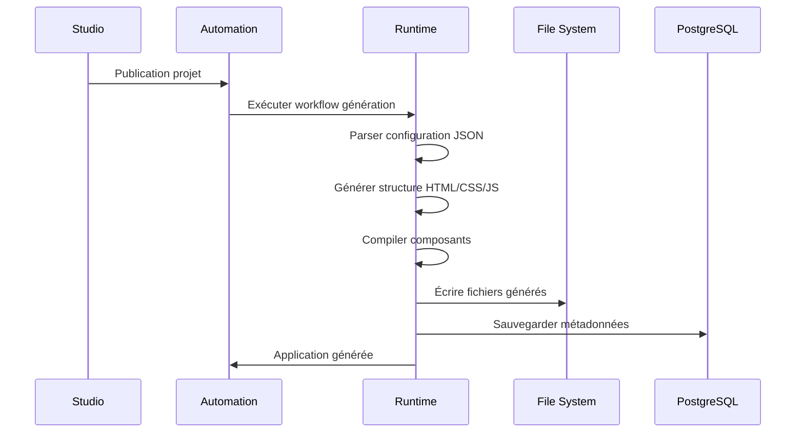
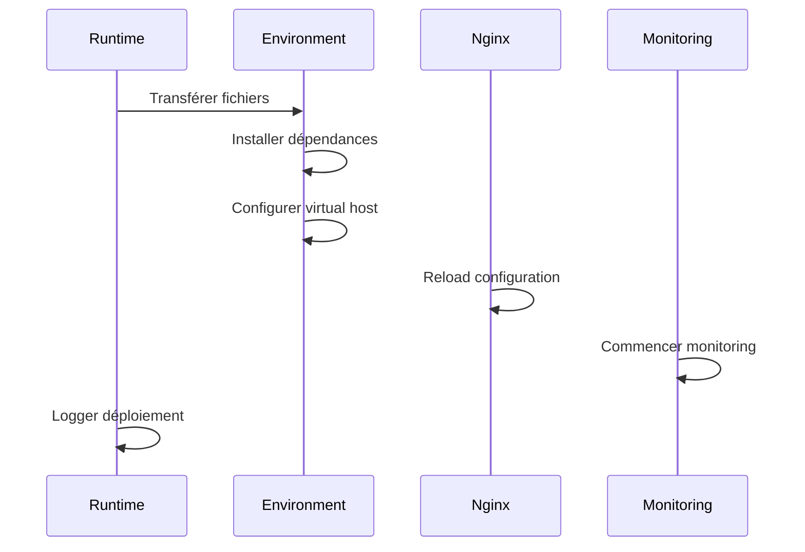
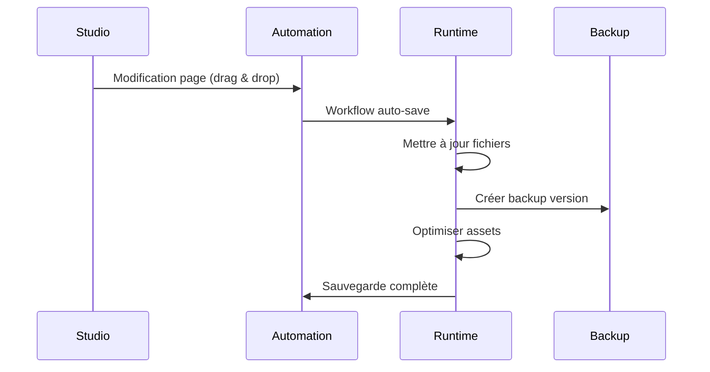

# 🚀 Runtime Module - Génération & Déploiement d'Applications

## 🎯 Rôle dans le Système NoCode

Runtime est le **module d'exécution** qui transforme les créations visuelles de Studio en applications web fonctionnelles. C'est un **module système** qui génère, déploie et maintient les applications créées par les utilisateurs. **L'utilisateur n'interagit jamais directement avec ce module.**

### Responsabilités Principales
- **Génération automatique** d'applications web depuis les configurations JSON
- **Déploiement** vers différents environnements (dev, staging, prod)
- **Gestion des versions** et rollback des applications
- **Optimisation** des performances (minification, compression)
- **Monitoring** des applications déployées
- **Stockage des fichiers** générés et assets

---

## 👥 Interface Utilisateur vs Système

### ❌ ENDPOINTS UTILISATEUR (Non accessibles directement)

**AUCUN** - L'utilisateur ne doit jamais accéder directement aux endpoints Runtime.

### ✅ ENDPOINTS SYSTÈME (Gérés automatiquement)

#### Applications Générées
```http
GET    /api/runtime/generated-apps/              # Liste applications système
POST   /api/runtime/generated-apps/              # Générer application (système)
GET    /api/runtime/generated-apps/{id}/         # Détails application
PUT    /api/runtime/generated-apps/{id}/         # Mettre à jour application
DELETE /api/runtime/generated-apps/{id}/         # Supprimer application
POST   /api/runtime/generated-apps/{id}/deploy/  # Déployer application
POST   /api/runtime/generated-apps/{id}/rollback/ # Rollback version
```

#### Déploiements
```http
GET    /api/runtime/deployments/                 # Historique déploiements
POST   /api/runtime/deployments/                 # Créer déploiement
GET    /api/runtime/deployments/{id}/            # Détails déploiement
POST   /api/runtime/deployments/{id}/cancel/     # Annuler déploiement
GET    /api/runtime/deployments/{id}/logs/       # Logs déploiement
```

#### Configurations Runtime
```http
GET    /api/runtime/configs/                     # Configurations système
POST   /api/runtime/configs/                     # Créer configuration
GET    /api/runtime/configs/{id}/                # Détails configuration
PUT    /api/runtime/configs/{id}/                # Mettre à jour config
```

#### Logs et Monitoring
```http
GET    /api/runtime/logs/                        # Logs applications
GET    /api/runtime/logs/{id}/                   # Détails log
POST   /api/runtime/logs/search/                 # Rechercher logs
GET    /api/runtime/metrics/                     # Métriques applications
```

---

## 🔄 Flux de Données dans Runtime

### 1. Génération d'Application depuis Studio


### 2. Déploiement Automatique


### 3. Sauvegarde Automatique


---

## 🏗️ Structure des Modèles

### GeneratedApp (Application générée)
```python
class GeneratedApp(models.Model):
    name = models.CharField(max_length=200)
    project = models.ForeignKey('studio.Project', on_delete=models.CASCADE)
    version = models.CharField(max_length=50)
    status = models.CharField(choices=STATUS_CHOICES)
    config = models.JSONField(default=dict)
    build_config = models.JSONField(default=dict)
    deployment_url = models.URLField(blank=True)
    created_at = models.DateTimeField(auto_now_add=True)
    built_at = models.DateTimeField(null=True, blank=True)
```

### DeploymentLog (Journal de déploiement)
```python
class DeploymentLog(models.Model):
    app = models.ForeignKey(GeneratedApp, on_delete=models.CASCADE)
    environment = models.CharField(max_length=50)
    status = models.CharField(choices=DEPLOYMENT_STATUS)
    started_at = models.DateTimeField(auto_now_add=True)
    completed_at = models.DateTimeField(null=True, blank=True)
    deployment_type = models.CharField(max_length=50)
    message = models.TextField(blank=True)
    error_details = models.JSONField(default=dict)
```

---

## 🔧 Processus de Génération

### 1. Parsing JSON de Studio
```python
def parse_studio_config(project_json):
    """Transformer la configuration Studio en structure d'application"""
    return {
        'pages': [parse_page(page) for page in project_json['pages']],
        'components': extract_components(project_json),
        'styles': compile_styles(project_json['styles']),
        'assets': collect_assets(project_json),
        'routes': generate_routes(project_json['pages'])
    }

def parse_page(page_json):
    """Parser une page individuelle"""
    return {
        'name': page_json['name'],
        'url': page_json.get('url', f"/{page_json['name'].lower()}"),
        'components': [parse_component(comp) for comp in page_json['components']],
        'layout': page_json['layout'],
        'meta': page_json.get('meta', {})
    }
```

### 2. Génération des Fichiers
```python
def generate_html_page(page_config):
    """Générer le HTML d'une page depuis les composants"""
    html = f"""
    <!DOCTYPE html>
    <html lang="fr">
    <head>
        <meta charset="UTF-8">
        <meta name="viewport" content="width=device-width, initial-scale=1.0">
        <title>{page_config['name']}</title>
        <link rel="stylesheet" href="/static/styles.css">
    </head>
    <body>
        <div class="page-container">
    """
    
    for component in page_config['components']:
        html += generate_component_html(component)
    
    html += """
        </div>
        <script src="/static/app.js"></script>
    </body>
    </html>
    """
    
    return html

def generate_component_html(component):
    """Générer le HTML d'un composant"""
    component_type = component['type']
    config = component['config']
    
    if component_type == 'Header':
        return f"""
        <header class="component-header" data-id="{component['id']}">
            <h1>{config.get('title', '')}</h1>
            <p>{config.get('subtitle', '')}</p>
        </header>
        """
    elif component_type == 'Form':
        return generate_form_html(config)
    # ... autres types de composants
```

### 3. Compilation des Styles
```python
def compile_css_from_components(components_config):
    """Compiler le CSS depuis les configurations de composants"""
    css = """
    /* Styles générés automatiquement depuis NoCode Studio */
    * { box-sizing: border-box; }
    body { margin: 0; font-family: Inter, sans-serif; }
    """
    
    # Ajouter les styles de chaque composant
    for component in components_config:
        css += compile_component_css(component)
    
    # Optimiser et minifier
    return minify_css(css)

def compile_component_css(component):
    """Générer le CSS d'un composant"""
    base_css = f".component-{component['type'].lower()} {{ "
    
    for property, value in component.get('styles', {}).items():
        base_css += f"{property}: {value}; "
    
    base_css += " }"
    
    # Ajouter les styles responsive
    if 'responsive' in component:
        base_css += generate_responsive_css(component['responsive'])
    
    return base_css
```

### 4. Génération du JavaScript
```python
def generate_app_js(pages_config):
    """Générer le JavaScript de l'application"""
    js = """
    // Application NoCode générée automatiquement
    class NoCodeApp {
        constructor() {
            this.pages = """ + json.dumps(pages_config) + """;
            this.currentPage = window.location.pathname;
            this.init();
        }
        
        init() {
            this.loadComponents();
            this.bindEvents();
            this.initAnalytics();
        }
        
        loadComponents() {
            document.querySelectorAll('[data-component]').forEach(el => {
                const componentType = el.dataset.component;
                this.loadComponent(componentType, el);
            });
        }
        
        bindEvents() {
            // Liaison des événements des formulaires
            document.querySelectorAll('form').forEach(form => {
                form.addEventListener('submit', this.handleFormSubmit.bind(this));
            });
        }
        
        handleFormSubmit(event) {
            event.preventDefault();
            const formData = new FormData(event.target);
            
            // Envoyer les données via API
            fetch('/api/submit-form', {
                method: 'POST',
                body: formData
            }).then(response => {
                if (response.ok) {
                    this.showSuccessMessage(event.target);
                }
            });
        }
    }
    
    // Initialiser l'application
    document.addEventListener('DOMContentLoaded', () => {
        new NoCodeApp();
    });
    """
    
    return minify_js(js)
```

---

## 📁 Structure des Fichiers Générés

### Arborescence Type
```
generated_apps/
├── project_123/
│   ├── v1.0.0/
│   │   ├── index.html
│   │   ├── about.html
│   │   ├── contact.html
│   │   ├── static/
│   │   │   ├── css/
│   │   │   │   ├── styles.css
│   │   │   │   └── components.css
│   │   │   ├── js/
│   │   │   │   ├── app.js
│   │   │   │   └── components.js
│   │   │   └── images/
│   │   │       └── uploads/
│   │   └── assets/
│   │       ├── favicon.ico
│   │       └── manifest.json
│   └── v1.1.0/  # Version suivante
└── project_456/
    └── ...
```

### Configuration de Déploiement
```json
{
  "app": {
    "id": "app-123",
    "name": "Mon Application NoCode",
    "version": "1.0.0",
    "environment": "production"
  },
  "deployment": {
    "type": "static",
    "target": "/var/www/nocode-apps/project_123/",
    "url": "https://apps.nocode.com/project_123/",
    "ssl_enabled": true,
    "cdn_enabled": true
  },
  "optimization": {
    "minify_html": true,
    "minify_css": true,
    "minify_js": true,
    "compress_images": true,
    "enable_gzip": true
  },
  "features": {
    "analytics_enabled": true,
    "forms_enabled": true,
    "api_integration": true,
    "seo_optimized": true
  }
}
```

---

## 🔄 Intégration avec les Autres Modules

### Réception des Signaux de Studio
```python
@receiver(post_save, sender=studio.models.Page)
def page_updated_handler(sender, instance, **kwargs):
    """Quand une page est modifiée dans Studio"""
    project = instance.project
    
    # Mettre à jour l'application générée
    try:
        app = GeneratedApp.objects.get(project=project, status='ACTIVE')
        update_app_from_studio(app, project)
    except GeneratedApp.DoesNotExist:
        # Créer une nouvelle application si aucune n'existe
        create_app_from_project(project)

@receiver(post_save, sender=studio.models.Project)
def project_published_handler(sender, instance, **kwargs):
    """Quand un projet est publié"""
    if instance.status == 'PUBLISHED':
        # Générer et déployer la version de production
        generate_production_app(instance)
```

### Communication avec Automation
```python
def execute_deployment_workflow(app, environment):
    """Exécuter le workflow de déploiement via Automation"""
    from appsautomation.tasks import execute_workflow
    
    workflow_data = {
        'app_id': app.id,
        'environment': environment,
        'deployment_type': 'FULL_DEPLOY'
    }
    
    execute_workflow.delay('deployment_workflow', workflow_data)
```

### Envoi des Métriques vers Insights
```python
def track_deployment_metrics(deployment):
    """Envoyer les métriques de déploiement vers Insights"""
    from apps.insights.services import track_metric
    
    metrics = {
        'deployment_time_seconds': deployment.duration,
        'files_count': deployment.files_count,
        'total_size_mb': deployment.total_size_mb,
        'success_rate': 1.0 if deployment.status == 'SUCCESS' else 0.0
    }
    
    track_metric('deployment_completed', metrics)
```

---

## 🚀 Processus de Déploiement

### 1. Pré-déploiement
```python
def pre_deployment_checks(app):
    """Vérifications avant déploiement"""
    checks = {
        'files_exist': check_generated_files(app),
        'config_valid': validate_deployment_config(app),
        'dependencies_met': check_dependencies(app),
        'disk_space': check_disk_space(app)
    }
    
    return all(checks.values()), checks
```

### 2. Déploiement
```python
def deploy_app(app, environment):
    """Déployer l'application vers un environnement"""
    deployment = DeploymentLog.objects.create(
        app=app,
        environment=environment,
        status='STARTED'
    )
    
    try:
        # Backup version actuelle
        backup_current_version(app, environment)
        
        # Transférer fichiers
        transfer_files(app, environment)
        
        # Configuration serveur
        configure_server(app, environment)
        
        # Reload services
        reload_services(app, environment)
        
        # Tests de santé
        health_check_passed = run_health_checks(app, environment)
        
        if health_check_passed:
            deployment.status = 'SUCCESS'
            deployment.completed_at = timezone.now()
        else:
            raise Exception("Health checks failed")
            
    except Exception as e:
        deployment.status = 'FAILED'
        deployment.error_details = {'error': str(e)}
        rollback_deployment(app, environment)
    
    deployment.save()
    return deployment
```

### 3. Post-déploiement
```python
def post_deployment_tasks(deployment):
    """Tâches après déploiement réussi"""
    if deployment.status == 'SUCCESS':
        # Nettoyer anciennes versions
        cleanup_old_versions(deployment.app)
        
        # Mettre à jour DNS si nécessaire
        update_dns_records(deployment.app, deployment.environment)
        
        # Notifier les utilisateurs
        notify_deployment_success(deployment)
        
        # Démarrer monitoring
        start_monitoring(deployment.app)
```

---

## 📊 Monitoring et Maintenance

### Métriques Surveillance
- **Performance** : Temps de chargement, taille des fichiers
- **Disponibilité** : Uptime, temps de réponse
- **Erreurs** : 404, 500, timeouts
- **Utilisation** : Nombre de requêtes, bande passante
- **Ressources** : CPU, mémoire, disque

### Logs Structurés
```python
def log_deployment_event(app, event_type, details):
    """Logger les événements de déploiement"""
    log_entry = {
        'timestamp': timezone.now().isoformat(),
        'app_id': app.id,
        'app_name': app.name,
        'event_type': event_type,
        'environment': app.environment,
        'details': details
    }
    
    # Envoyer vers système de logging
    logger.info(f"Deployment event: {json.dumps(log_entry)}")
```

### Maintenance Automatique
```python
@shared_task
def maintenance_tasks():
    """Tâches de maintenance périodiques"""
    # Nettoyer les anciennes versions
    cleanup_old_deployments()
    
    # Optimiser les assets
    optimize_static_assets()
    
    # Vérifier l'intégrité des fichiers
    verify_file_integrity()
    
    # Mettre à jour les certificats SSL
    update_ssl_certificates()
```

---

## 🔧 Configuration et Dépannage

### Variables d'Environnement
```bash
# Runtime Settings
RUNTIME_STORAGE_PATH=/var/www/nocode-apps/
RUNTIME_BASE_URL=https://apps.nocode.com/
RUNTIME_MAX_APP_SIZE_MB=100
RUNTIME_MAX_VERSIONS_PER_APP=10

# Deployment Settings
DEPLOYMENT_TIMEOUT=300  # 5 minutes
DEPLOYMENT_RETRY_COUNT=3
HEALTH_CHECK_INTERVAL=30  # secondes

# Optimization Settings
ENABLE_MINIFICATION=true
ENABLE_COMPRESSION=true
ENABLE_CDN=true
IMAGE_QUALITY=85
```

### Problèmes Courants
- **Déploiement échoué** : Vérifier l'espace disque et permissions
- **Application inaccessible** : Vérifier configuration Nginx/DNS
- **Performance lente** : Optimiser assets et activer cache
- **Fichiers manquants** : Regénérer l'application

### Commands Utiles
```bash
# Regénérer une application
python manage.py regenerate_app <app_id>

# Vérifier l'état des déploiements
python manage.py check_deployments

# Nettoyer les anciennes versions
python manage.py cleanup_old_versions

# Tester une application localement
python manage.py test_app <app_id>
```

---

## 📈 Performance et Optimisation

### Optimisations Automatiques
- **Minification** HTML/CSS/JavaScript
- **Compression** Gzip des ressources
- **Optimisation images** (WebP, lazy loading)
- **Cache CDN** pour assets statiques
- **HTTP/2** pour chargement parallèle

### Stratégies de Cache
```python
# Configuration cache nginx
location ~* \.(css|js|png|jpg|jpeg|gif|ico|svg)$ {
    expires 1y;
    add_header Cache-Control "public, immutable";
    add_header X-Content-Type-Options nosniff;
}

# Cache pour pages HTML
location ~* \.html$ {
    expires 1h;
    add_header Cache-Control "public";
}
```

---

## 🔗 Références Techniques

### Configuration Complète d'Application
```json
{
  "application": {
    "id": "app-123",
    "name": "Portfolio NoCode",
    "version": "1.2.0",
    "framework": "static-html",
    "status": "deployed"
  },
  "structure": {
    "pages": [
      {
        "name": "index",
        "url": "/",
        "title": "Accueil - Portfolio",
        "components": 8,
        "size_kb": 45
      }
    ],
    "routes": {
      "/": "index.html",
      "/about": "about.html",
      "/contact": "contact.html"
    }
  },
  "optimization": {
    "minified": true,
    "compressed": true,
    "optimized_images": true,
    "bundle_size_kb": 156,
    "performance_score": 95
  },
  "deployment": {
    "environment": "production",
    "url": "https://portfolio.nocode.com",
    "ssl": true,
    "cdn": true,
    "deployed_at": "2024-01-15T10:30:00Z"
  }
}
```

---

**Runtime** transforme les créations visuelles en applications web réelles, performantes et professionnelles. Chaque drag & drop dans Studio devient automatiquement une application déployée, optimisée et monitorée.
