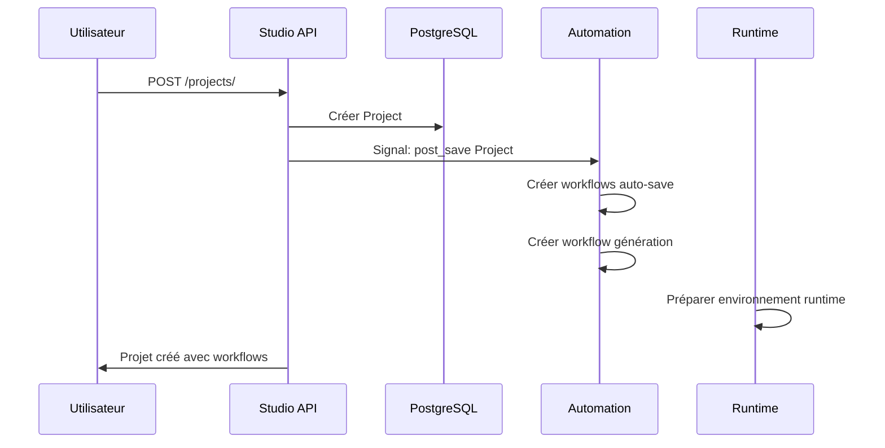
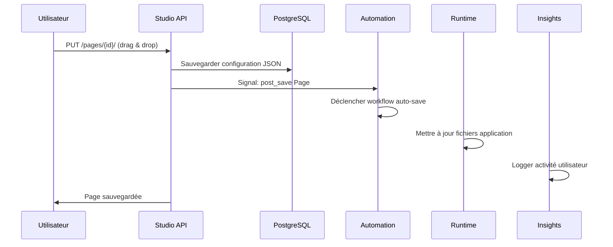
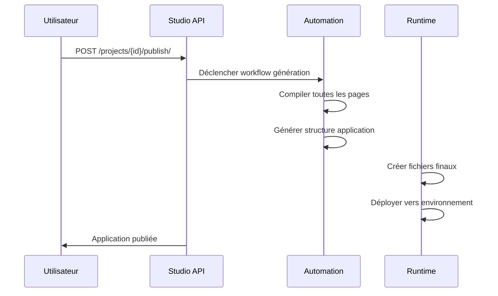

# 🎨 Studio Module - Drag & Drop & Création d'Applications

## 🎯 Rôle dans le Système NoCode

Studio est le module **créatif** où les utilisateurs construisent leurs applications par drag & drop. C'est un **module utilisateur** - il fournit l'interface visuelle pour créer des pages, des composants et des projets sans écrire de code.

### Responsabilités Principales
- **Création de projets** NoCode
- **Éditeur visuel** drag & drop pour les pages
- **Gestion des composants** réutilisables
- **Collaboration temps réel** entre utilisateurs
- **Versioning** des pages et projets
- **Stockage JSON** des configurations

---

## 👥 Interface Utilisateur vs Système

### ✅ ENDPOINTS UTILISATEUR (Accessibles directement)

#### Projets
```http
GET    /api/studio/projects/                     # Liste projets utilisateur
POST   /api/studio/projects/                     # Créer nouveau projet
GET    /api/studio/projects/{id}/                # Détails projet
PUT    /api/studio/projects/{id}/                # Modifier projet
DELETE /api/studio/projects/{id}/                # Supprimer projet
POST   /api/studio/projects/{id}/publish/        # Publier projet
```

#### Pages (Drag & Drop)
```http
GET    /api/studio/projects/{id}/pages/          # Liste pages projet
POST   /api/studio/projects/{id}/pages/          # Créer nouvelle page
GET    /api/studio/pages/{id}/                   # Détails page
PUT    /api/studio/pages/{id}/                   # Mettre à jour page (drag & drop)
DELETE /api/studio/pages/{id}/                   # Supprimer page
POST   /api/studio/pages/{id}/duplicate/         # Dupliquer page
```

#### Composants
```http
GET    /api/studio/components/                   # Composants disponibles
POST   /api/studio/components/                   # Créer composant personnalisé
GET    /api/studio/components/{id}/              # Détails composant
PUT    /api/studio/components/{id}/              # Modifier composant
DELETE /api/studio/components/{id}/              # Supprimer composant
```

#### Collaboration
```http
GET    /api/studio/pages/{id}/collaboration/     # Session collaboration
POST   /api/studio/pages/{id}/join/              # Rejoindre édition
POST   /api/studio/pages/{id}/leave/             # Quitter édition
GET    /api/studio/pages/{id}/active-users/      # Utilisateurs actifs
```

#### Instances de Composants (résultat du drag & drop)
```http
GET    /api/studio/pages/{id}/components/        # Composants sur page
POST   /api/studio/pages/{id}/components/        # Ajouter composant (drag)
PUT    /api/studio/component-instances/{id}/     # Déplacer/Redimensionner
DELETE /api/studio/component-instances/{id}/     # Supprimer de page
```

### ❌ ENDPOINTS SYSTÈME (Gérés automatiquement)

Studio n'a pas d'endpoints système cachés, mais il **déclenche** des processus automatiques dans d'autres modules.

---

## 🔄 Flux de Données dans Studio

### 1. Création de Projet → Workflows Automatiques


### 2. Drag & Drop → Sauvegarde Automatique


### 3. Publication → Génération d'Application


---

## 🏗️ Structure des Modèles

### Project (Projet NoCode)
```python
class Project(models.Model):
    name = models.CharField(max_length=200)
    description = models.TextField(blank=True)
    owner = models.ForeignKey(User, on_delete=models.CASCADE)
    status = models.CharField(choices=STATUS_CHOICES)  # DRAFT, PUBLISHED, ARCHIVED
    config = models.JSONField(default=dict)  # Configuration globale
    created_at = models.DateTimeField(auto_now_add=True)
    updated_at = models.DateTimeField(auto_now=True)
```

### Page (Page d'application)
```python
class Page(models.Model):
    name = models.CharField(max_length=200)
    project = models.ForeignKey(Project, on_delete=models.CASCADE)
    page_type = models.CharField(max_length=50)  # LANDING, FORM, DASHBOARD
    status = models.CharField(max_length=20)  # DRAFT, PUBLISHED
    config = models.JSONField(default=dict)  # Configuration drag & drop
    layout = models.JSONField(default=dict)   # Structure de la page
    styles = models.JSONField(default=dict)   # CSS personnalisé
    created_at = models.DateTimeField(auto_now_add=True)
```

### Component (Composant réutilisable)
```python
class Component(models.Model):
    name = models.CharField(max_length=100)
    display_name = models.CharField(max_length=100)
    description = models.TextField(blank=True)
    category = models.CharField(max_length=50)  # FORM, DISPLAY, INPUT, LAYOUT
    icon = models.CharField(max_length=50)
    properties = models.JSONField(default=dict)  # Propriétés configurables
    validation_rules = models.JSONField(default=dict)
    default_config = models.JSONField(default=dict)
    is_active = models.BooleanField(default=True)
    version = models.CharField(max_length=20, default="1.0.0")
```

### ComponentInstance (Composant sur une page)
```python
class ComponentInstance(models.Model):
    component = models.ForeignKey(Component, on_delete=models.CASCADE)
    page = models.ForeignKey(Page, on_delete=models.CASCADE)
    position = models.JSONField(default=dict)  # x, y, width, height
    config = models.JSONField(default=dict)    # Configuration personnalisée
    styles = models.JSONField(default=dict)    # Styles personnalisés
```

### CollaborationSession (Édition collaborative)
```python
class CollaborationSession(models.Model):
    project = models.ForeignKey(Project, on_delete=models.CASCADE)
    user = models.ForeignKey(User, on_delete=models.CASCADE)
    is_active = models.BooleanField(default=True)
    last_activity = models.DateTimeField(auto_now=True)
    cursor_position = models.JSONField(default=dict)
```

---

## 🎨 Format JSON des Configurations

### Structure de Page (drag & drop)
```json
{
  "page": {
    "id": "page-123",
    "name": "Page d'accueil",
    "layout": "grid",
    "breakpoints": {
      "mobile": 768,
      "tablet": 1024,
      "desktop": 1200
    }
  },
  "components": [
    {
      "id": "comp-456",
      "type": "Header",
      "position": {"x": 0, "y": 0, "width": 12, "height": 1},
      "config": {
        "title": "Bienvenue !",
        "subtitle": "Mon application NoCode",
        "backgroundImage": "url('/images/header-bg.jpg')"
      }
    },
    {
      "id": "comp-789",
      "type": "Form",
      "position": {"x": 4, "y": 2, "width": 4, "height": 6},
      "config": {
        "fields": [
          {"name": "email", "type": "email", "label": "Email", "required": true},
          {"name": "message", "type": "textarea", "label": "Message", "required": false}
        ],
        "submitText": "Envoyer",
        "successMessage": "Merci pour votre message !"
      }
    }
  ],
  "styles": {
    "primaryColor": "#3B82F6",
    "fontFamily": "Inter",
    "spacing": "medium"
  }
}
```

### Configuration de Composant
```json
{
  "component": {
    "name": "ContactForm",
    "category": "FORM",
    "version": "1.2.0"
  },
  "properties": {
    "title": {
      "type": "string",
      "label": "Titre du formulaire",
      "default": "Contactez-nous"
    },
    "fields": {
      "type": "array",
      "label": "Champs du formulaire",
      "itemType": "field"
    },
    "submitColor": {
      "type": "color",
      "label": "Couleur du bouton",
      "default": "#3B82F6"
    }
  },
  "validation": {
    "required": ["title"],
    "maxFields": 10,
    "allowedFieldTypes": ["text", "email", "textarea", "select"]
  }
}
```

---

## 🔄 Intégration avec les Autres Modules

### Signaux Émis par Studio
```python
# Quand un projet est créé
@receiver(post_save, sender=Project)
def project_created(sender, instance, created, **kwargs):
    if created:
        # Automation crée les workflows par défaut
        # Runtime prépare l'environnement
        pass

# Quand une page est modifiée (drag & drop)
@receiver(post_save, sender=Page)
def page_updated(sender, instance, **kwargs):
    # Automation déclenche l'auto-sauvegarde
    # Runtime met à jour les fichiers
    # Insights enregistre l'activité
    pass

# Quand un composant est ajouté
@receiver(post_save, sender=ComponentInstance)
def component_added(sender, instance, **kwargs):
    # Validation des configurations
    # Mise à jour des dépendances
    pass
```

### Déclenchements Automatiques
1. **Auto-sauvegarde** : Toutes les 30 secondes pendant l'édition
2. **Validation** : À chaque ajout de composant
3. **Collaboration** : WebSocket pour les modifications temps réel
4. **Versioning** : Création de version à chaque publication

---

## 🌐 Collaboration Temps Réel

### WebSocket Integration
```javascript
// Connexion à une session d'édition
const ws = new WebSocket(`ws://localhost:8000/ws/studio/page/${pageId}/`);

ws.onmessage = function(event) {
    const data = JSON.parse(event.data);
    switch(data.type) {
        case 'user_joined':
            addUserToList(data.user);
            break;
        case 'component_moved':
            updateComponentPosition(data.componentId, data.position);
            break;
        case 'cursor_moved':
            updateRemoteCursor(data.userId, data.position);
            break;
    }
};

// Envoyer les modifications
function moveComponent(componentId, newPosition) {
    ws.send(JSON.stringify({
        type: 'move_component',
        componentId: componentId,
        position: newPosition
    }));
}
```

### Gestion des Conflits
- **Last writer wins** pour les modifications simples
- **Locking** pour les modifications complexes
- **Notification** des conflits aux utilisateurs
- **Auto-merge** quand possible

---

## 🎯 Composants Disponibles

### Catégories de Composants
1. **DISPLAY** : Header, Footer, Card, Image, Text
2. **FORM** : Input, Select, Textarea, Checkbox, Radio
3. **LAYOUT** : Grid, Container, Divider, Spacer
4. **NAVIGATION** : Menu, Breadcrumb, Tabs, Pagination
5. **MEDIA** : Image Gallery, Video Player, Audio Player
6. **DATA** : Table, Chart, List, Calendar

### Composants Personnalisés
Les utilisateurs peuvent créer leurs propres composants :
- Définir les propriétés configurables
- Spécifier les règles de validation
- Ajouter des logiques métier personnalisées
- Partager entre projets

---

## 🚨 Bonnes Pratiques et Performance

### Optimisation JSON
- **Compression** des configurations JSON
- **Lazy loading** des composants
- **Cache Redis** des pages fréquemment accédées
- **Indexation PostgreSQL** sur les champs JSON

### Validation et Sécurité
- **Validation côté serveur** de toutes les configurations
- **Sanitization** des inputs utilisateur
- **XSS protection** dans les rendus de composants
- **CSRF protection** sur toutes les mutations

### Limits et Quotas
- **Max composants par page** : 100
- **Max profondeur** : 5 niveaux d'imbrication
- **Max taille JSON** : 1MB par page
- **Max sessions collaboration** : 10 par page

---

## 🔧 Configuration et Dépannage

### Variables d'Environnement
```bash
# WebSocket Settings
WS_PROTOCOL=ws
WS_HOST=localhost
WS_PORT=8000

# Collaboration Settings
MAX_COLLABORATION_USERS=10
COLLABORATION_TIMEOUT=300  # 5 minutes

# File Upload Settings
MAX_UPLOAD_SIZE=10485760  # 10MB
ALLOWED_IMAGE_TYPES=jpg,jpeg,png,gif,webp
```

### Problèmes Courants
- **Drag & drop lent** : Vérifier la taille JSON et le cache
- **Collaboration bug** : Vérifier la connexion WebSocket
- **Composant invisible** : Valider la configuration JSON
- **Export échoue** : Vérifier les permissions et quotas

---

## 📈 Évolution et Scalabilité

### Fonctionnalités Futures
- **Templates** de pages et composants
- **Marketplace** de composants communautaires
- **AI Assistant** pour suggestions de design
- **Version control** avancé avec branches

### Scaling Considerations
- **CDN** pour les assets statiques
- **Database sharding** par projet
- **Redis cluster** pour les sessions
- **Microservices** pour le rendering

---

## 🔗 Références API

### Exemple de Requête (Drag & Drop)
```bash
# Créer une page avec drag & drop
curl -X POST http://localhost:8000/api/studio/projects/123/pages/ \
  -H "Authorization: Bearer <access_token>" \
  -H "Content-Type: application/json" \
  -d '{
    "name": "Page d''accueil",
    "page_type": "LANDING",
    "config": {
      "components": [
        {
          "id": "header-1",
          "type": "Header",
          "position": {"x": 0, "y": 0, "width": 12, "height": 2},
          "config": {
            "title": "Bienvenue sur mon site",
            "subtitle": "Créé avec NoCode"
          }
        }
      ]
    },
    "layout": {
      "type": "grid",
      "columns": 12,
      "spacing": "medium"
    }
  }'

# Mettre à jour la position d''un composant
curl -X PUT http://localhost:8000/api/studio/component-instances/456/ \
  -H "Authorization: Bearer <access_token>" \
  -H "Content-Type: application/json" \
  -d '{
    "position": {"x": 2, "y": 3, "width": 8, "height": 4}
  }'
```

### WebSocket Connection
```javascript
// Se connecter à l'édition collaborative
const ws = new WebSocket('ws://localhost:8000/ws/studio/page/123/');

// Envoyer la position du curseur
ws.send(JSON.stringify({
    type: 'cursor_move',
    position: {x: 150, y: 200}
}));
```

---

**Studio** transforme la création d'applications en une expérience visuelle intuitive. Chaque drag & drop génère automatiquement les workflows et configurations nécessaires dans les autres modules, rendant le développement NoCode puissant et flexible.
